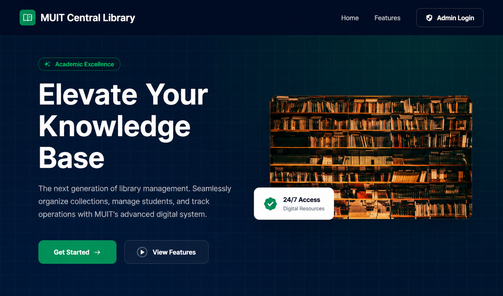
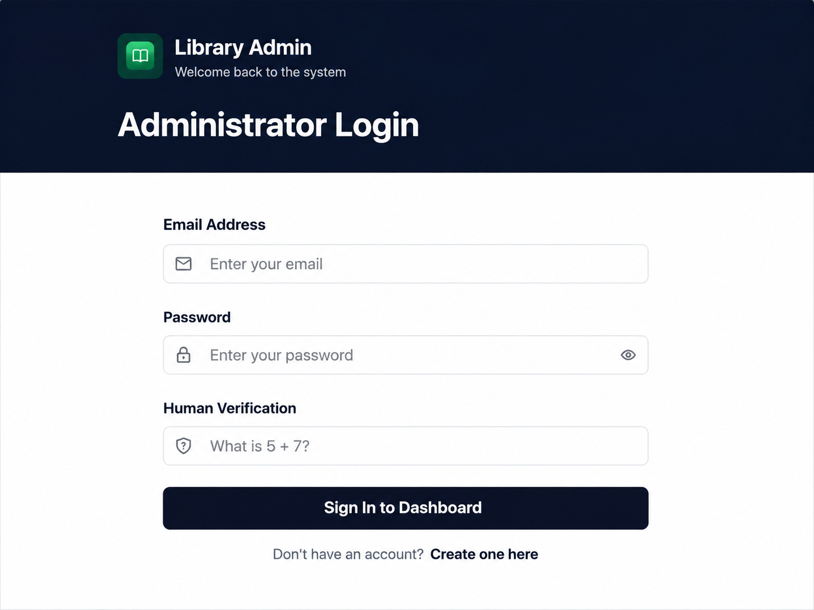
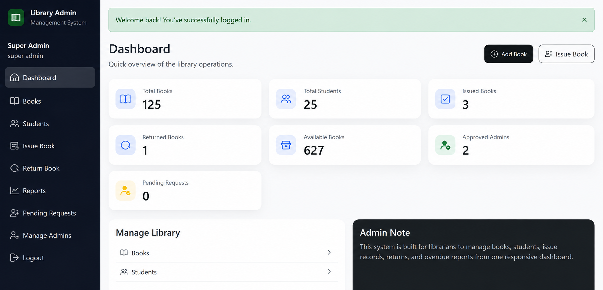
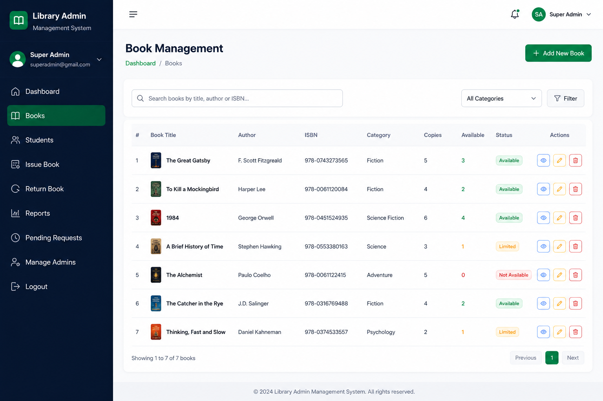
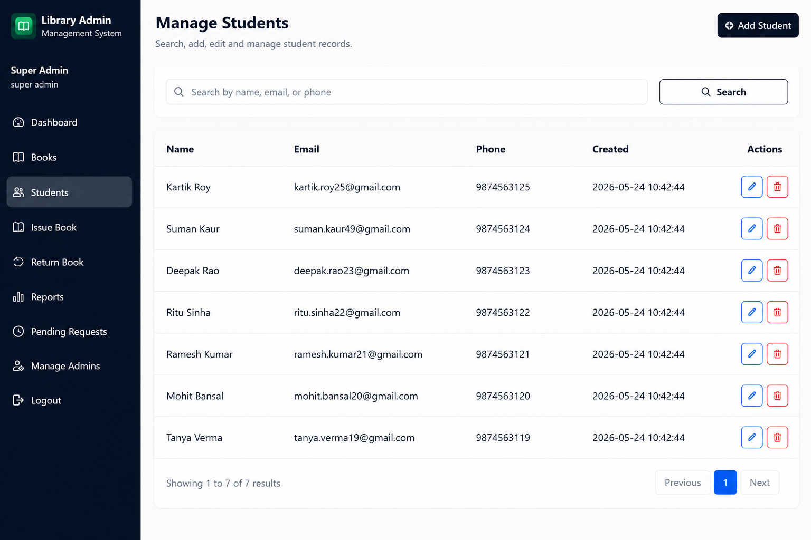
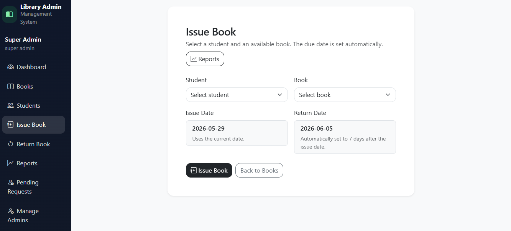
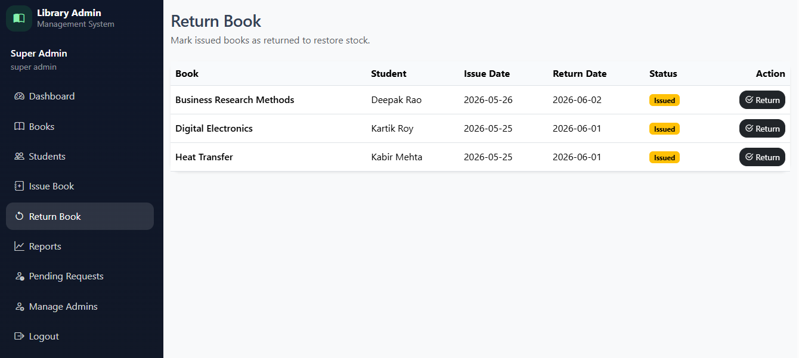
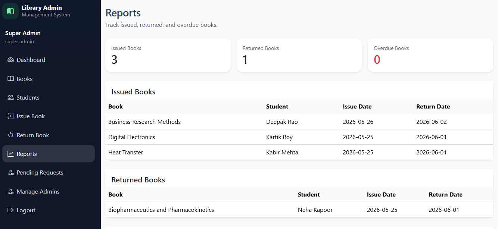
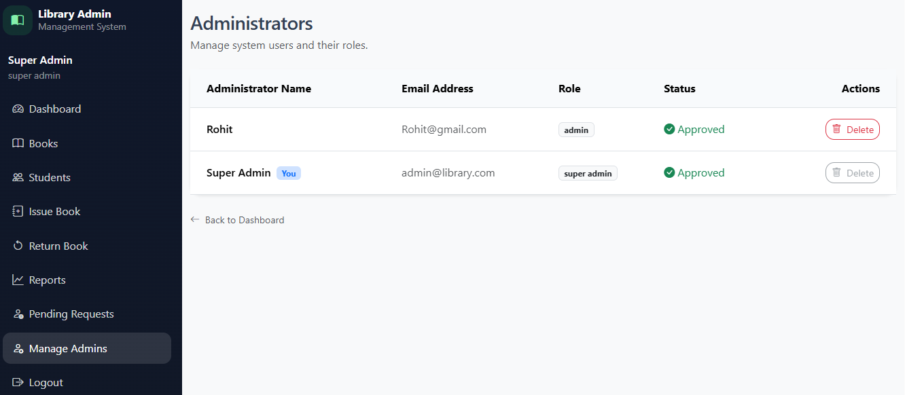

# MUIT Central Library Management System

A luxurious, modern, and admin-focused E-Library Management System built with PHP, MySQL, and Bootstrap 5.

## 🌟 New Features

- **Modern UI/UX**: Redesigned landing page with 3D illustrative hero section, glassmorphism effects, and responsive layout.
- **Role-Based Access Control (RBAC)**:
    - `super_admin`: Full access to manage admins, approve/reject requests, and view all reports.
    - `admin`: Manage books, students, and circulation (issue/return).
- **Secure Authentication**: Transitioned to `password_hash()` for secure credential storage.
- **Admin Approval Workflow**: New admin registrations are set to `pending` by default and must be approved by a Super Admin.
- **Floating Illustration**: Interactive CSS-based 3D book illustration with animated floating icons.

## 🛠️ Tech Stack

- **Backend**: PHP 8.x
- **Database**: MySQL / MariaDB
- **Frontend**: Bootstrap 5, Bootstrap Icons, Google Fonts (Inter)
- **Environment**: XAMPP / WAMP / MAMP

## 📁 Folder Structure

- `admin/` - Admin & Super Admin interfaces
- `assets/` - Custom CSS, images, and static assets
- `includes/` - Core logic (Auth, DB, Functions, Layout)
- `database/` - SQL schema and seed data

## 📸 Project Screenshots

### 1️⃣ Homepage
Modern landing page with responsive design and digital library features.

### 2️⃣ Admin Login
Secure administrator authentication with human verification.

### 3️⃣ Dashboard
Centralized dashboard showing books, students, issued books, returns, and system statistics.

### 4️⃣ Book Management
Manage library inventory with search, update, and delete functionality.

### 5️⃣ Student Management
Student record management with search and administration features.

### 6️⃣ Issue Book
Issue books to students with automatic due-date assignment.

### 7️⃣ Return Book
Track and process returned books efficiently.

### 8️⃣ Reports
Generate and monitor issued, returned, and overdue book reports.

### 9️⃣ Admin Management
Manage administrator accounts, roles, and permissions.

## 🚀 Setup Instructions

1. **Clone/Copy**: Move the project to your local server directory (e.g., `htdocs` for XAMPP).
2. **Database**:
    - Open `phpMyAdmin`.
    - Create a database named `library_management_system`.
    - Import the `database/library.sql` file.
3. **Configuration**:
    - Rename `includes/config.php.example` to `includes/config.php`.
    - Update the database credentials in `config.php` if different from default.
4. **Access**:
    - Open `http://localhost/library` in your browser.

## 🔐 Default Credentials

- **Super Admin**: `admin@library.com` / `password` (hashed in DB)
- **New Registrations**: Will require approval from the Super Admin before login.

